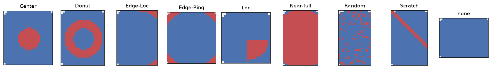
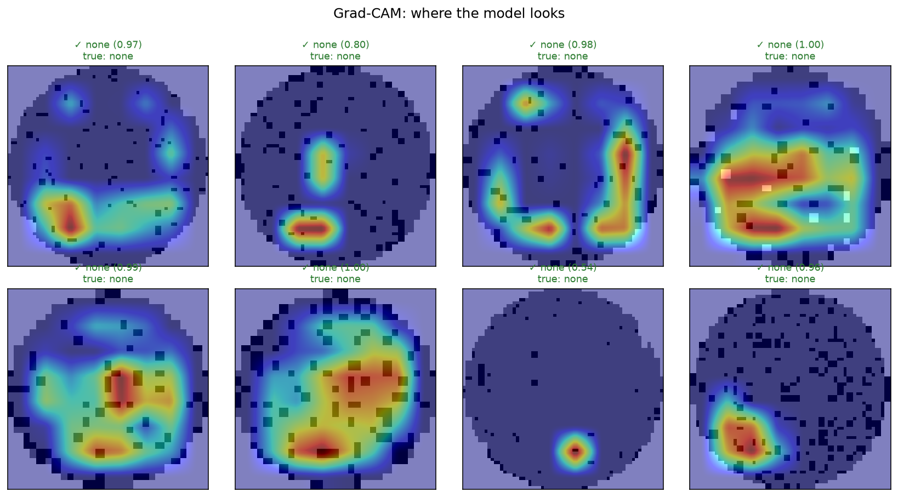
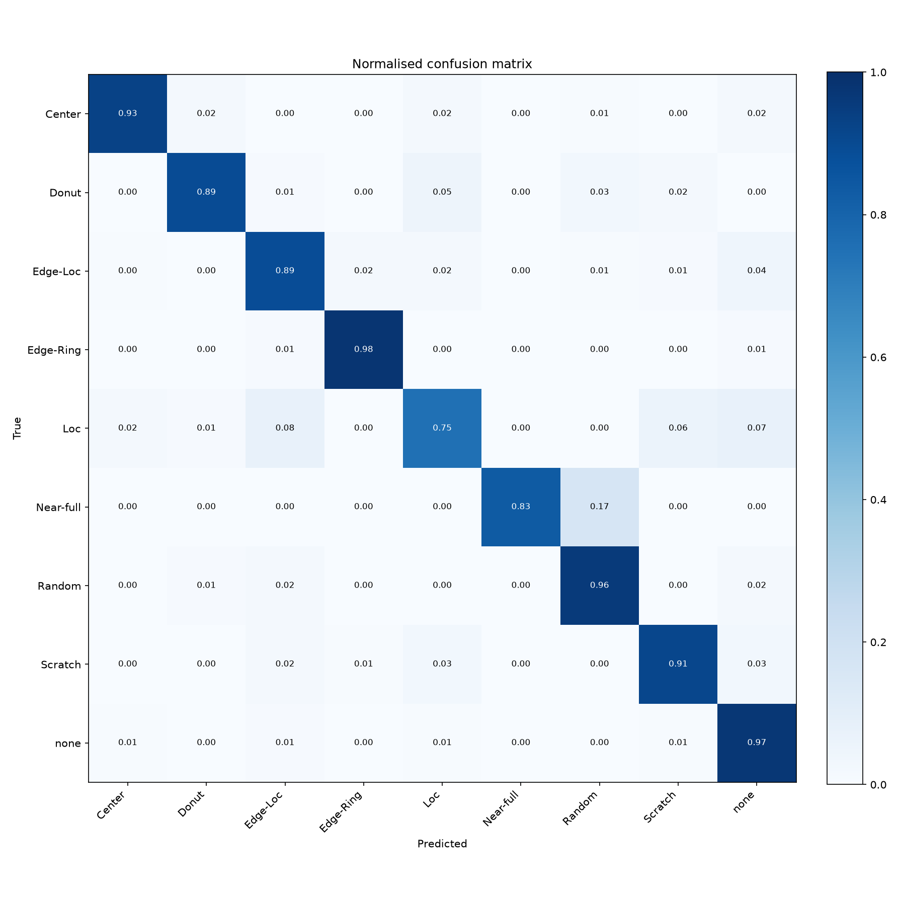
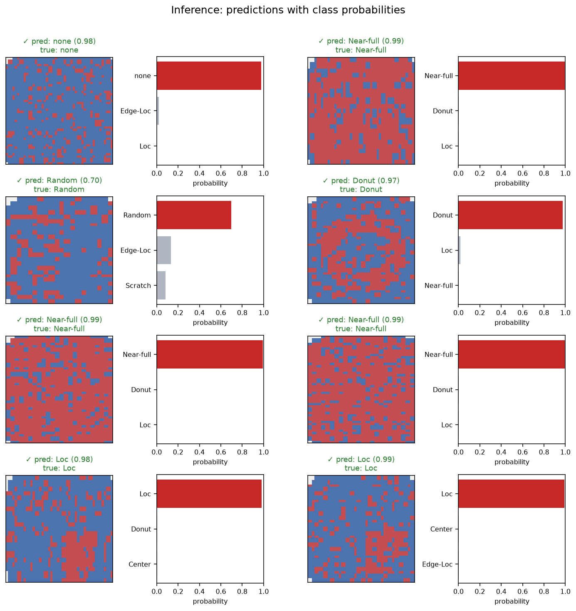
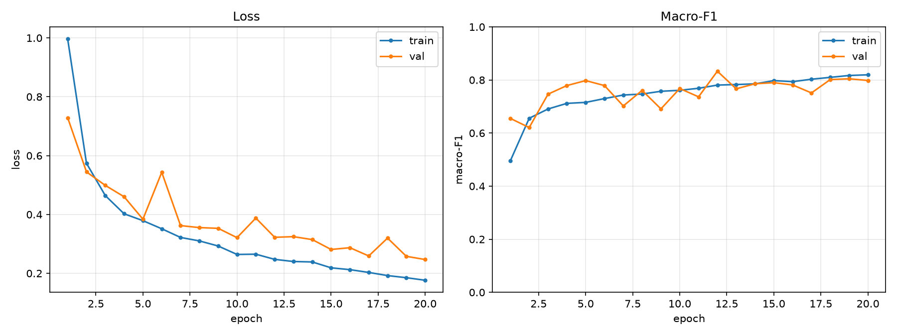
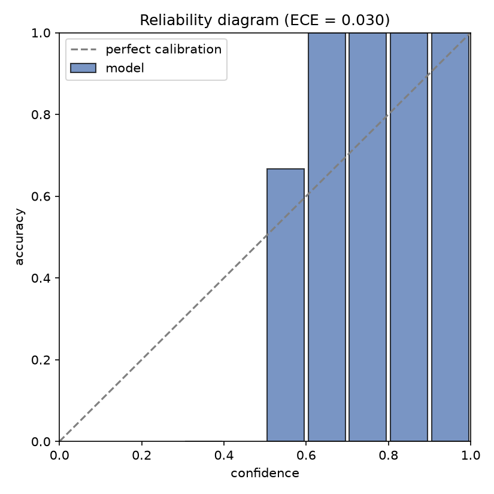
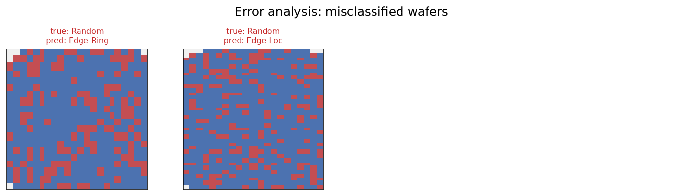
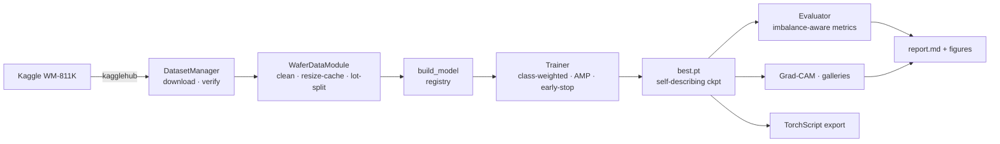
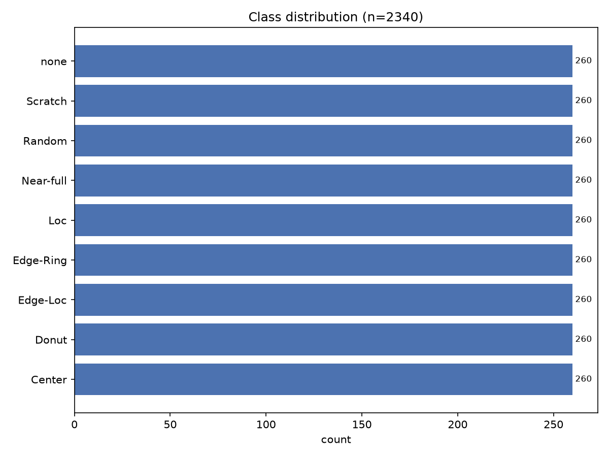
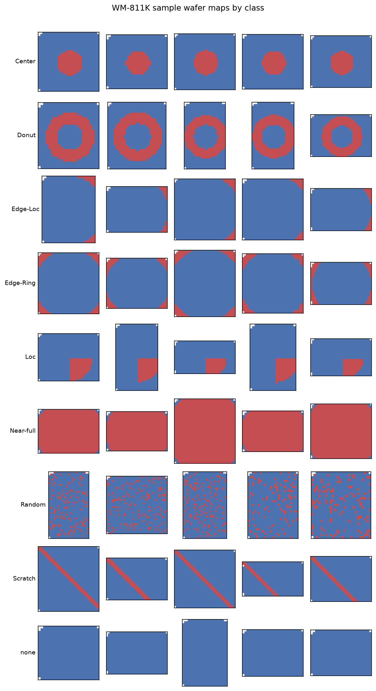

<div align="center">

# 🔬 WM-811K Wafer-Map Defect Classifier

**Leakage-free deep learning for semiconductor wafer-map defect classification — automated data, Grad-CAM explainability, and one-command reproducible reports.**

[](https://github.com/NayeonKim925/wm-wafer-map/actions/workflows/ci.yml?query=branch%3Amain)
[](https://www.python.org/)
[](https://pytorch.org/)
[](https://github.com/astral-sh/ruff)
[](LICENSE)



</div>

Classify the nine canonical defect patterns of the
[WM-811K](https://www.kaggle.com/datasets/qingyi/wm811k-wafer-map) dataset with a
clean, extensible PyTorch pipeline. **One command does everything** — it
downloads the ~800K-wafer dataset, trains, evaluates *without lot leakage*, and
writes a self-contained visual report:

```bash
git clone https://github.com/NayeonKim925/wm-wafer-map.git && cd wm-wafer-map
pip install -r requirements.txt
python train.py
```

No manual data download. No paths to edit. No dataset committed to git.

---

## ✨ Highlights

| | |
| --- | --- |
| 🤖 **Zero-touch data** | Automated Kaggle download + integrity verification via `kagglehub` (`DatasetManager`). Nothing large in git. |
| 🚫 **Leakage-free eval** | Group-aware split by `lotName` (or the official split) so correlated wafers never straddle train/test — *the* difference between honest and inflated numbers. |
| 🔥 **Grad-CAM** | See *where* the model looks — attention overlays confirm it keys on the real defect signature. |
| 📊 **Rich reporting** | Every run auto-generates `report.md`: metrics tables + confusion matrix + per-class F1 + prediction gallery + Grad-CAM + error analysis + calibration. |
| ⚙️ **Config-driven** | One typed YAML drives everything; no hardcoded paths; CLI overrides for every field. |
| 🧩 **Extensible** | Add a model with one `@register_model` decorator; swap data representations in one place. |
| 🚀 **Deployment** | One-command TorchScript export with a preprocessing sidecar. |
| ✅ **Tested + CI** | 80+ `pytest` tests on synthetic data (no download), incl. a no-lot-leakage assertion; ruff + pytest on 3.10–3.12 in CI. |

> **About the figures below.** They are generated by this pipeline on a small
> **synthetic** dataset that mirrors the WM-811K schema (so the repo's demo and CI
> need no 2 GB download). They illustrate the *tooling*, not real WM-811K
> benchmark numbers — run `python train.py` on the real dataset to reproduce.

## 🔥 Explainability — Grad-CAM

The model's attention lands on the actual defect region: the localized blob for
`Loc`, the ring for `Donut`, the periphery for `Edge-Ring`.



## 📈 Results at a glance

<table>
<tr>
<td width="50%"></td>
<td width="50%"></td>
</tr>
<tr>
<td align="center"><em>Normalised confusion matrix (test)</em></td>
<td align="center"><em>Predictions with class probabilities</em></td>
</tr>
<tr>
<td width="50%"></td>
<td width="50%"></td>
</tr>
<tr>
<td align="center"><em>Loss &amp; macro-F1 per epoch</em></td>
<td align="center"><em>Calibration (reliability) diagram + ECE</em></td>
</tr>
</table>

Every run also writes a Markdown **experiment report** ([`report.md`](docs/EXAMPLE_REPORT.md))
stitching these together with the metrics and configuration.

---

## 📑 Table of contents

- [Quickstart](#-quickstart)
- [Automatic dataset download](#-automatic-dataset-download)
- [Data splitting &amp; evaluation protocol](#-data-splitting--evaluation-protocol)
- [Training](#-training)
- [Evaluation &amp; reporting](#-evaluation--reporting)
- [Inference &amp; visualisation](#-inference--visualisation)
- [Explainability](#-explainability-grad-cam-1)
- [Deployment](#-deployment-torchscript)
- [Project structure](#-project-structure)
- [Architecture](#-architecture)
- [Configuration](#-configuration)
- [The dataset](#-the-dataset)
- [Testing &amp; CI](#-testing--ci)
- [Roadmap](#-roadmap)
- [Citation](#-citation)

## 🚀 Quickstart

```bash
pip install -r requirements.txt

python scripts/visualize_dataset.py     # (optional) explore the data first
python train.py                         # download + train + evaluate + report
python train.py --config configs/smoke.yaml   # ~1-min CPU sanity run

# use a trained checkpoint
CKPT=outputs/wafer_cnn/<run>/checkpoints/best.pt
python evaluate.py  --checkpoint $CKPT
python inference.py --checkpoint $CKPT --input wafers.npy --gallery preds.png --gradcam cam.png
python scripts/export_model.py --checkpoint $CKPT      # -> TorchScript
```

Prefer `make`? `make help` lists `install`, `eda`, `train`, `train-smoke`,
`evaluate`, `export`, `test`, and `lint`.

## 🤖 Automatic dataset download

The dataset is fetched on demand and **never stored in version control**.
`DatasetManager` (`src/data/dataset_manager.py`):

1. **Locates** an existing copy under `datasets/wm811k/`.
2. **Downloads** from Kaggle via `kagglehub.dataset_download("qingyi/wm811k-wafer-map")` if missing.
3. **Materialises** it project-locally (symlink by default — no 2 GB copy; copy fallback).
4. **Verifies** the expected files exist and are not truncated.
5. **Returns** a stable path; re-runs skip the download.

```bash
python scripts/download_dataset.py           # download + verify + print location
python scripts/download_dataset.py --force   # force a fresh re-download
```

**Kaggle credentials.** The dataset is public and usually downloads anonymously.
On a 403/auth error, set `KAGGLE_USERNAME` / `KAGGLE_KEY` or drop a
`~/.kaggle/kaggle.json` (see [`.env.example`](.env.example)). Errors are caught
and explained, not dumped as a stack trace.

## 🧪 Data splitting & evaluation protocol

How you split WM-811K decides whether your numbers are honest. Wafers are grouped
into **lots** processed together, so wafers from one lot are strongly correlated.
Splitting them randomly leaks information from test into train and **inflates**
results. This project is leakage-free by default (`data.split_strategy`):

| Strategy | Leakage-free | Use it for |
| --- | :---: | --- |
| `lot` *(default)* | ✅ | Honest generalisation to unseen lots |
| `official` | ✅¹ | Comparability with published WM-811K benchmarks |
| `random` | ❌ | Quick experiments only (optimistic metrics) |

```bash
python train.py --set data.split_strategy=lot        # default, leakage-free
python train.py --set data.split_strategy=official   # dataset's own train/test
```

¹ The official `Training`/`Test` flag is per-wafer and not guaranteed
lot-disjoint; train⊥val is still enforced lot-aware. A no-lot-leakage test guards
the `lot` split in CI. For a rigorous result, sweep seeds (`--set seed=0/1/2`) and
report mean ± std.

## 🏋️ Training

```bash
python train.py                               # defaults
python train.py --set training.epochs=60 model.name=wafer_resnet
```

Each run creates a timestamped, self-contained directory:

```
outputs/wafer_cnn/<timestamp>/
├── config.resolved.yaml     # exact config used
├── train.log                # full log
├── history.json             # per-epoch metrics
├── training_curves.png
├── label_mapping.json
├── checkpoints/{best,last}.pt
├── evaluation/              # classification_report.json, confusion_matrix.{csv,png}, per_class_f1.png
├── report/                  # prediction_gallery.png, gradcam.png, misclassified.png, reliability.png
└── report.md                # everything stitched into one document
```

Under the hood: device auto-select (CUDA→MPS→CPU), leakage-free split, one-time
cached resize, class-weighted loss, cosine LR, gradient clipping, optional AMP,
early stopping on val macro-F1, and best-checkpoint test evaluation.

## 📊 Evaluation & reporting

```bash
python evaluate.py --checkpoint <ckpt>              # test split, config recovered from ckpt
python evaluate.py --checkpoint <ckpt> --split val
```

Because the labelled subset is ~85% `none`, evaluation is **imbalance-aware**:
accuracy, **balanced accuracy**, macro/weighted precision-recall-F1, **Cohen's κ**,
a full per-class report, a normalised confusion matrix, a per-class F1 chart, and a
**calibration diagram with ECE**.

## 🔮 Inference & visualisation

Classify wafers from a `.npy` (single map or object array) or `.pkl` (a DataFrame
with a `waferMap` column), and optionally render figures:

```bash
python inference.py --checkpoint <ckpt> --input wafers.npy \
    --output preds.json --gallery gallery.png --gradcam cam.png
```

```python
from src.inference import Predictor
predictor = Predictor.from_checkpoint("outputs/wafer_cnn/<run>/checkpoints/best.pt")
print(predictor.predict_one(wafer_map))   # {'predicted_class': 'Center', 'confidence': 0.98, 'top_k': [...]}
```

**Error analysis** (misclassified wafers, true vs predicted) is produced automatically:



## 🔥 Explainability (Grad-CAM)

Grad-CAM ([Selvaraju et al., 2017](https://arxiv.org/abs/1610.02391)) highlights the
regions driving a prediction. `src/interpretability/` provides a reusable `GradCAM`
(hooks the last conv layer, cleans up via a context manager) and an overlay gallery,
exposed through `inference.py --gradcam` and included in every report.

## 🚀 Deployment (TorchScript)

```bash
python scripts/export_model.py --checkpoint <ckpt> --output model.ts.pt
```

Produces a self-contained TorchScript module (loadable with `torch.jit.load`, no
dependency on this repo) plus a JSON sidecar describing the preprocessing contract
— ready for LibTorch / TorchServe. (`torch.export`/ONNX are natural alternatives.)

## 📁 Project structure

```
wm-wafer-map/
├── train.py · evaluate.py · inference.py     # entry points
├── configs/            # default.yaml (documented) + smoke.yaml
├── scripts/            # download_dataset · visualize_dataset · export_model
├── src/
│   ├── config/         # typed hierarchical config (dataclasses + YAML)
│   ├── data/           # DatasetManager, datamodule (leakage-free splits), preprocessing, EDA viz
│   ├── models/         # WaferCNN, WaferResNet + build registry
│   ├── training/       # Trainer, optimizers, schedulers
│   ├── evaluation/     # metrics, evaluator, plots (cm, curves, F1, errors, calibration)
│   ├── inference/      # Predictor (+ TorchScript export) + prediction galleries
│   ├── interpretability/  # Grad-CAM
│   ├── reporting/      # Markdown experiment report
│   └── utils/          # logging, seeding, device, paths, plotting, checkpoints
├── docs/               # MODEL_CARD.md, example report, README assets
├── tests/              # pytest suite (synthetic data, kagglehub mocked)
└── .github/workflows/  # CI (ruff + pytest, py3.10–3.12)
```

## 🏗️ Architecture



Design principles: single-responsibility modules, no duplicated logic, no
hardcoded paths, `logging` everywhere (never `print` in library code), and
self-describing checkpoints so eval/inference/export need nothing external.
See [`docs/MODEL_CARD.md`](docs/MODEL_CARD.md) for the model card.

## ⚙️ Configuration

Precedence: dataclass defaults → YAML (`--config`) → dotted CLI overrides
(`--set a.b=c`). Unknown keys are rejected (no silent typos), and the resolved
config is saved with every run.

```bash
python train.py --config configs/smoke.yaml --set training.optimizer.lr=5e-4 data.image_size=96
```

## 🗂️ The dataset

**WM-811K**: 811,457 real wafer maps (~172,950 labelled). Each is a variable-sized
grid of `{0: background, 1: passing die, 2: failing die}`, labelled with one of
`Center`, `Donut`, `Edge-Loc`, `Edge-Ring`, `Loc`, `Near-full`, `Random`,
`Scratch`, or `none`. The pipeline cleans the quirky nested-array labels, resizes
once (nearest-neighbour, categorical-preserving) into a cached `uint8` stack, and
one-hot encodes. Class imbalance is severe, and the defect patterns are visually
distinct:

<table>
<tr>
<td width="42%"></td>
<td width="58%"></td>
</tr>
<tr>
<td align="center"><em>Class distribution (imbalanced)</em></td>
<td align="center"><em>Example wafer maps per class</em></td>
</tr>
</table>

## ✅ Testing & CI

```bash
pip install -r requirements-dev.txt
pytest            # 80+ tests on synthetic data, kagglehub mocked
ruff check .
```

CI (GitHub Actions) runs ruff and the full suite on Python 3.10, 3.11 and 3.12.
The suite includes a no-lot-leakage assertion, a Grad-CAM shape/round-trip check,
worker-seeding determinism, and a TorchScript export round-trip.

## 🗺️ Roadmap

- [ ] k-fold cross-validation harness + mean ± std reporting
- [ ] Optional TensorBoard / Weights & Biases logging
- [ ] Self-supervised pre-training on the ~640K unlabelled wafers
- [ ] ONNX export and a minimal FastAPI serving example

## 📚 Citation

If this project is useful, please cite it (see [`CITATION.cff`](CITATION.cff)). The
WM-811K dataset is distributed by its authors via Kaggle under its own terms.

## 📄 License

[MIT](LICENSE).
