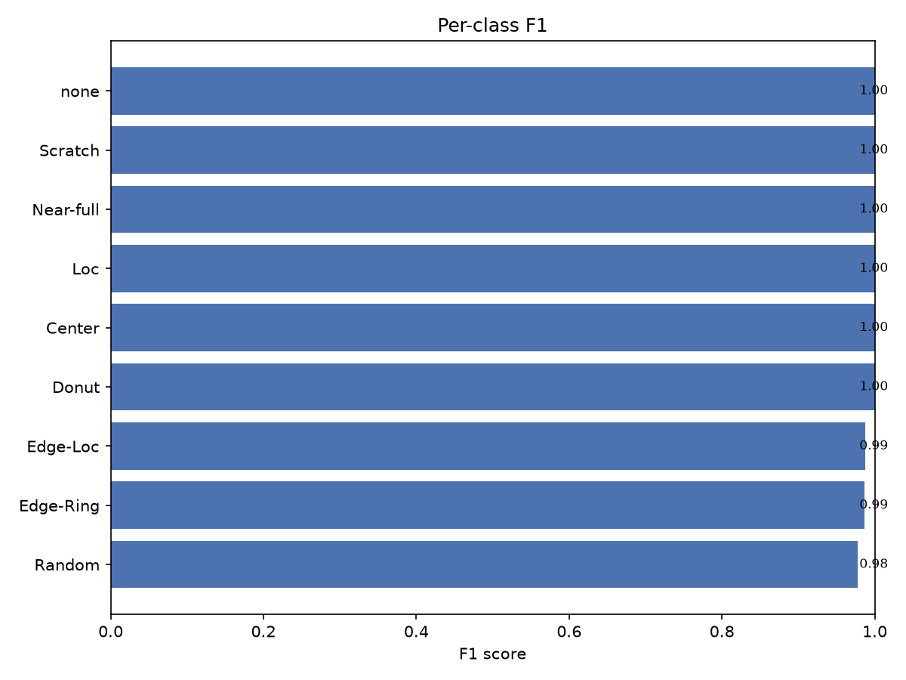

# Experiment report — wm811k_demo

_Auto-generated 2026-08-03 18:28:46._

> **Note:** this is an example report generated by `python train.py` on the bundled **synthetic** demo dataset (to illustrate the tooling without the 2 GB download). Run on the real WM-811K to reproduce genuine benchmark numbers.

## Run configuration

| Setting | Value |
| --- | --- |
| Model | `wafer_cnn` (base_channels=24) |
| Split strategy | `lot` |
| Image size | 48 |
| Representation | `onehot` |
| Epochs | 25 |
| Optimizer | `adamw` (lr=0.001) |
| Classes | 9 |
| Seed | 42 |

## Test metrics

| Metric | Value |
| --- | --- |
| Accuracy | 0.9947 |
| Balanced accuracy | 0.9952 |
| Macro-F1 | 0.9947 |
| Weighted-F1 | 0.9947 |
| Cohen's κ | 0.9941 |

## Per-class F1 (test)

| Class | Precision | Recall | F1 | Support |
| --- | --- | --- | --- | --- |
| Center | 1.000 | 1.000 | 1.000 | 37 |
| Donut | 1.000 | 1.000 | 1.000 | 40 |
| Edge-Loc | 0.976 | 1.000 | 0.988 | 41 |
| Edge-Ring | 0.973 | 1.000 | 0.986 | 36 |
| Loc | 1.000 | 1.000 | 1.000 | 51 |
| Near-full | 1.000 | 1.000 | 1.000 | 45 |
| Random | 1.000 | 0.957 | 0.978 | 46 |
| Scratch | 1.000 | 1.000 | 1.000 | 43 |
| none | 1.000 | 1.000 | 1.000 | 41 |

## Figures

**Training and validation loss / macro-F1 per epoch.**

**Row-normalised confusion matrix on the test split.**

**Per-class F1 on the test split.**

**Sample predictions with class probabilities.**

**Grad-CAM attention for the predicted class.**

**Error analysis: misclassified wafers (true vs predicted).**

**Calibration (reliability) diagram with ECE.**

